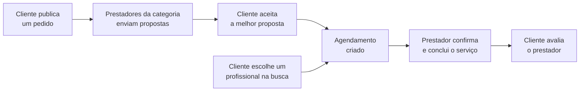

<div align="center">


### Conectamos você ao profissional certo

Plataforma que conecta clientes a prestadores de serviços domésticos em **Taquara/RS**:
faxina, jardinagem, reparos, elétrica, pintura e encanamento, com agendamento rápido e avaliações reais.


</div>

---

##  Sobre o projeto

Encontrar alguém de confiança para limpar a casa, cuidar do jardim ou consertar uma tomada ainda depende muito de indicação boca a boca. O **IService** reúne clientes e prestadores de serviços domésticos de Taquara/RS em um só lugar.

- **Clientes** comparam preços e avaliações, conversam com o prestador e agendam o serviço.
- **Prestadores** divulgam seus serviços, recebem pedidos da sua área e montam sua reputação com avaliações.

O projeto foi desenvolvido como **Trabalho de Conclusão de Curso (TCC)**.

---

##  Funcionalidades

###  Para clientes
- Buscar profissionais por nome, serviço ou categoria, com ordenação por preço
- Agendar um serviço escolhendo data e horário
- Publicar um **pedido** e receber **propostas** de vários prestadores
- Aceitar uma proposta, o que gera o agendamento automaticamente
- Cancelar agendamentos e pedidos
- Favoritar profissionais
- Avaliar o prestador (1 a 5 estrelas + comentário) depois do serviço concluído
- Painel com próximos agendamentos, pedidos, favoritos e histórico

###  Para prestadores
- Cadastrar e remover serviços (nome, categoria, preço e descrição)
- Confirmar, recusar ou concluir agendamentos
- Ver pedidos abertos na sua área e enviar propostas com valor e prazo
- Acompanhar o status das propostas enviadas (enviada, aceita, recusada)
- Perfil profissional com especialidade, disponibilidade, portfólio de fotos e avaliações recebidas
- Painel com indicadores: serviços, agendamentos, pendentes, cancelados e avaliação média

###  Na plataforma toda
-  **Chat** entre cliente e prestador
-  **Notificações** de novas propostas, propostas aceitas e avaliações
-  **Central de ajuda** (FAQ)
-  Autenticação com **JWT** e senhas criptografadas com **bcrypt**
-  Layout **responsivo**, do celular ao monitor Full HD

---

##  Como funciona



Um agendamento pode nascer de dois jeitos: o cliente contrata direto pela busca, ou aceita uma proposta recebida para um pedido.

---

##  Tecnologias

| Camada | Tecnologias |
|---|---|
| **Backend** | Node.js, Express, Mongoose, JSON Web Token, bcryptjs, dotenv, CORS |
| **Banco de dados** | MongoDB (Atlas) |
| **Frontend** | HTML5, CSS3 e JavaScript puro (sem framework) |
| **Interface** | Font Awesome 6, fonte Inter |
| **Desenvolvimento** | Nodemon |

---

##  Estrutura de pastas

```
site-iservice-main/
├── config/
│   └── database.js          # Conexão com o MongoDB
├── controllers/             # Regras de negócio de cada recurso
├── middleware/              # Autenticação JWT e controle de perfil (cliente/prestador)
├── Models/                  # Schemas do Mongoose
├── routes/
│   ├── userRoutes.js        # Rotas da API (/api/...)
│   └── chatRoutes.js        # Rotas do chat (/api/chat/...)
├── scripts/
│   └── seedFaq.js           # Popula as perguntas da Central de Ajuda
├── utils/
│   └── notificacaoHelper.js # Criação de notificações
├── site-iservice-main/      # Frontend (servido como arquivos estáticos)
│   ├── index.html           # Landing page
│   ├── home.css             # Identidade visual (cores, tipografia, header, footer, botões)
│   ├── app.css              # Componentes das páginas internas
│   ├── app.js               # Funções compartilhadas (menu, formatação, avisos, modais)
│   ├── notificacoes.js      # Sino de notificações
│   └── *.html               # Demais páginas
├── server.js                # Ponto de entrada do servidor
├── .env.example             # Modelo das variáveis de ambiente
└── package.json
```

---

##  Como rodar o projeto

### Pré-requisitos
- [Node.js](https://nodejs.org/) 18 ou superior
- Um banco MongoDB: uma conta gratuita no [MongoDB Atlas](https://www.mongodb.com/atlas) ou o MongoDB instalado na máquina

### Passo a passo

**1. Clone o repositório e entre na pasta**
```bash
git clone <url-do-repositorio>
cd site-iservice-main
```

**2. Instale as dependências**
```bash
npm install
```

**3. Crie o arquivo `.env`** na raiz, usando o `.env.example` como base:
```env
PORT=3000
NODE_ENV=development
MONGO_URI=mongodb+srv://<usuario>:<senha>@<cluster>.mongodb.net/iservice
JWT_SECRET=uma_frase_secreta_bem_grande
```

| Variável | Para que serve |
|---|---|
| `PORT` | Porta do servidor (padrão `3000`) |
| `NODE_ENV` | Ambiente de execução |
| `MONGO_URI` | Endereço de conexão com o MongoDB |
| `JWT_SECRET` | Chave usada para assinar os tokens de login |

>  O `.env` guarda a senha do banco. **Não envie esse arquivo para o GitHub**: coloque `.env` e `node_modules/` no `.gitignore`.

**4. (Opcional) Popule a Central de Ajuda**
```bash
node scripts/seedFaq.js
```

**5. Inicie o servidor**
```bash
npm start        # modo normal
npm run dev      # modo desenvolvimento (reinicia sozinho ao salvar)
```

**6. Acesse no navegador:** http://localhost:3000

Se tudo deu certo, o terminal mostra:
```
Servidor rodando na porta 3000
MongoDB conectado com sucesso
```

---

##  Páginas

| Página | Arquivo | Acesso |
|---|---|---|
| Landing page | `index.html` | Público |
| Login | `login.html` | Público |
| Criar conta | `cadastro.html` | Público |
| Central de ajuda | `faq.html` | Público |
| Categorias | `faxina.html`, `jardinagem.html`, `Reparos.html`, `eletrica.html`, `pintura.html`, `encanamento.html` | Público (faxina exige login) |
| Contratar | `contratar.html` | Público |
| Profissionais | `profissionais.html` | Logado |
| Chat | `chat.html` | Logado |
| Painel do cliente | `dashboard-cliente.html` | Cliente |
| Perfil do cliente | `perfil_cliente.html` | Cliente |
| Painel do prestador | `dashboard-prestador.html` | Prestador |
| Perfil do prestador | `perfil_prestador.html` | Prestador |

---

##  API

Base: `http://localhost:3000/api`

Rotas marcadas com  exigem o cabeçalho `Authorization: Bearer <token>`, recebido no login.

<details>
<summary><b>Autenticação</b></summary>

| Método | Rota | Descrição |
|---|---|---|
| `POST` | `/cadastro` | Cria uma conta (cliente ou prestador) |
| `POST` | `/login` | Faz login e retorna o token |

</details>

<details>
<summary><b>Serviços</b></summary>

| Método | Rota | Descrição |
|---|---|---|
| `GET` | `/servicos` | Lista todos os serviços |
| `GET` | `/servicos/categoria/:categoria` | Lista os serviços de uma categoria |
| `GET` | `/servicos/prestador` |  Serviços do prestador logado |
| `POST` | `/servicos` |  Prestador cadastra um serviço |
| `DELETE` | `/servicos/:id` |  Prestador remove um serviço |

</details>

<details>
<summary><b>Agendamentos</b></summary>

| Método | Rota | Descrição |
|---|---|---|
| `POST` | `/agendamentos` |  Cliente agenda um serviço |
| `GET` | `/agendamentos/cliente` |  Agendamentos do cliente |
| `GET` | `/agendamentos/prestador` |  Agendamentos do prestador |
| `PUT` | `/agendamentos/:id/status` |  Prestador confirma, recusa ou conclui |
| `PUT` | `/agendamentos/:id/cancelar` |  Cliente cancela |

</details>

<details>
<summary><b>Pedidos e propostas</b></summary>

| Método | Rota | Descrição |
|---|---|---|
| `POST` | `/pedidos` |  Cliente publica um pedido |
| `GET` | `/pedidos/cliente` |  Pedidos do cliente |
| `GET` | `/pedidos/abertos` |  Pedidos abertos (para prestadores) |
| `PUT` | `/pedidos/:id/cancelar` |  Cliente cancela um pedido |
| `POST` | `/propostas` |  Prestador envia uma proposta |
| `GET` | `/propostas/pedido/:id` |  Propostas recebidas em um pedido |
| `GET` | `/propostas/prestador` |  Propostas enviadas pelo prestador |
| `PUT` | `/propostas/:id/aceitar` |  Cliente aceita uma proposta (gera o agendamento) |

</details>

<details>
<summary><b>Avaliações e favoritos</b></summary>

| Método | Rota | Descrição |
|---|---|---|
| `POST` | `/avaliacoes` |  Cliente avalia um prestador |
| `GET` | `/avaliacoes/prestador/:id` | Avaliações de um prestador |
| `GET` | `/avaliacoes/prestador/:id/media` | Média e total de avaliações |
| `GET` | `/favoritos` |  Favoritos do cliente |
| `POST` | `/favoritos` |  Adiciona um favorito |
| `DELETE` | `/favoritos/:id` |  Remove um favorito |
| `GET` | `/favoritos/verificar/:prestador_id` |  Verifica se é favorito |

</details>

<details>
<summary><b>Notificações, usuário e FAQ</b></summary>

| Método | Rota | Descrição |
|---|---|---|
| `GET` | `/notificacoes` |  Últimas 30 notificações |
| `GET` | `/notificacoes/nao-lidas` |  Quantidade de não lidas |
| `PUT` | `/notificacoes/:id/lida` |  Marca uma notificação como lida |
| `GET` | `/usuario/:id/perfil` | Perfil público (portfólio e status online) |
| `PUT` | `/usuario/portifolio` |  Prestador atualiza o portfólio |
| `GET` | `/faq` | Perguntas da Central de Ajuda |

</details>

<details>
<summary><b>Chat</b></summary>

| Método | Rota | Descrição |
|---|---|---|
| `POST` | `/chat/start` |  Inicia (ou retoma) uma conversa com um prestador |
| `POST` | `/chat/message` |  Envia uma mensagem |
| `GET` | `/chat/:chatId` |  Mensagens de uma conversa |
| `GET` | `/chat` |  Conversas do usuário |
| `PUT` | `/chat/:chatId/read` |  Marca a conversa como lida |
| `GET` | `/chat/unread/count` |  Mensagens não lidas |

</details>

---

##  Identidade visual

A landing page é a referência de design de todo o sistema. As páginas internas reutilizam o `home.css` e só acrescentam componentes próprios no `app.css`.

| Cor | Hex | Uso |
|---|---|---|
|  Verde principal | `#4B9F3D` | Botões e destaques |
|  Verde escuro | `#1F7F15` | Gradiente dos botões |
|  Verde claro | `#77BF65` | Ícones e links |
|  Menta | `#A4DF8E` | Status e detalhes |
|  Fundo | `#0B1410` | Fundo das páginas |

Tipografia: **Inter**. Ícones: **Font Awesome 6**.

---

##  Próximos passos

- [ ] Recuperação de senha por e-mail
- [ ] Salvar os dados do perfil do prestador no banco (hoje ficam no navegador)
- [ ] Upload de fotos do portfólio (hoje é por URL)
- [ ] Deixar o endereço da API configurável para publicar o site online
- [ ] Filtro de profissionais por avaliação e disponibilidade

---

##  Equipe

| Nome | Função |
|---|---|
| [Seu nome] | [Função] |
| [Nome] | [Função] |

**Orientação:** [Nome do(a) professor(a) orientador(a)]
**Instituição:** [Nome da escola / curso]

---

<div align="center">

Feito com  em Taquara/RS · © 2026 IService

</div>
